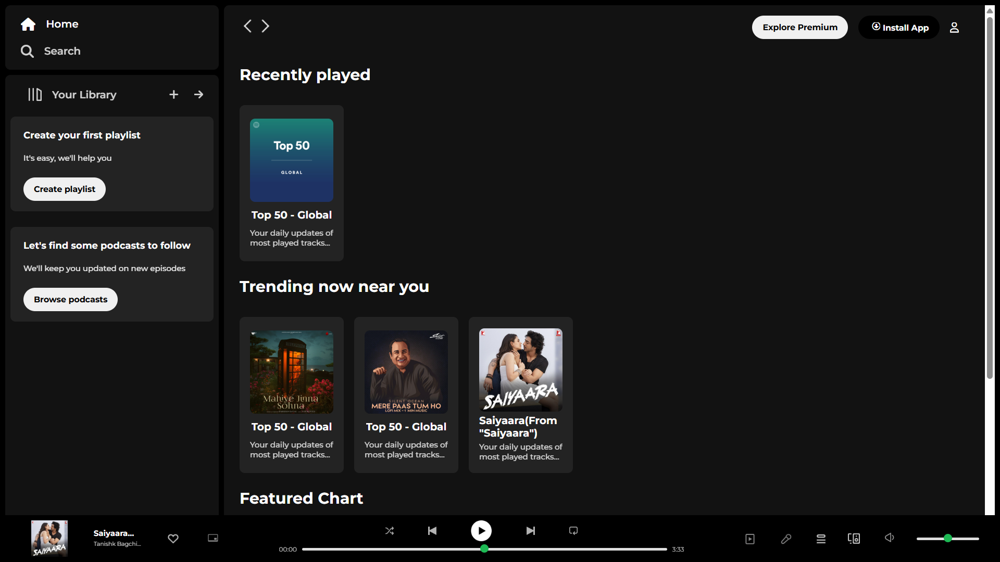

# 🎵 Spotify Clone

A simple frontend **Spotify clone** built using **HTML** and **CSS**.  
This project replicates the look of Spotify’s web interface.

## 🚀 Features

- Clean UI inspired by Spotify
- Responsive layout using CSS

## 🛠️ Tech Stack

- HTML5
- CSS3

## 📸 Screenshot

## 🌐 Live Demo

[Click Here to Visit](https://vishalyadav-git.github.io/spotify-clone)

## 📄 License

This project is open source and free to use for educational purposes.

